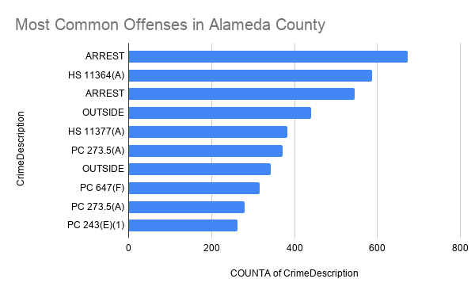
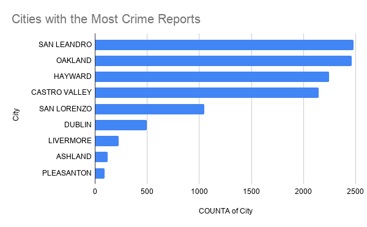

# J124-Final-Project
# The Alameda County Crime Reports Reveal What the Common Offenses are and Where They Occur

## Introduction

Crime data is essential in order for the community to gain a better understanding of patterns in public safety. However, it must be deconstructed carefully with context. 

Crime statistics can be misunderstood if they are presented without any context. In order to avoid misunderstanding I must clarify that higher numbers of reported crimes don't necessarily mean a community is less safe. The cities with larger populations and higher reporting rates can produce more reports.

In this project, I analyzed the Alameda County Crime Report dataset in order to examine which offenses were most common and which cities recorded the highest number of crime reports.

## About the Dataset

This project uses the Alameda County Crime Reports dataset whose data was collected by the Alameda County Sheriff's Office and made available through the Alameda County Open Data Portal.

[Alameda County Sheriff's Office crime reports covering the period July 2022 to present](https://data.acgov.org/datasets/53a54eb59d5f42038e80098384ba5156_2/explore?location=37.693191%2C-121.924887%2C10)

Since the dataset comes from a government agency it is typically considered a reliable source for documenting reported incidents. The only issue is that only the crimes reported through law enforcement are the ones that are recorded. So it doesn't measure crimes that went unreported or does it explain why crimes occurred. 

The dataset also has some minor spelling errors and incomplete information.

---

## Data Analysis

In order to analyze the data I imported the file into Google Sheets and then reviewed it for blank spots, incorrect spelling, and duplicate headings. Once fixed I created two pivot tables.

Google Sheets:

[Alameda County Crime Reports July 2022-Present](https://docs.google.com/spreadsheets/d/14pShk2vxSFuxMdSt-BlYk4zjxVabhrQptHXfskGDG2w/edit?gid=1490871859#gid=1490871859)

I used the first pivot table to count the frequency of each crime description. The second pivot table was used to count the number of crimes reported by the city. Using these two pivot tables helps summarize the records into patterns that are easier to understand and to visualize.

### Chart 1: Most Common Offense Descriptions

**Source:** Alameda County Open Data Portal, *Alameda County Crime Reports Dataset*. Analysis performed in Google Sheets.

The first pivot table covers the most common offense descriptions in the dataset. This included several warrant-related offenses, drug-related violations, and weapon offenses. These were the categories that appeared most frequently in the reported offenses.

### Chart 2: Crime Reports by City

**Source:** Alameda County Open Data Portal, *Alameda County Crime Reports Dataset*. Analysis performed in Google Sheets.

The second pivot table is a city analysis which shows that San Leandro, Oakland, Hayward, and Castro Valley are the cities with the largest number of crime reports in this dataset. The influencing factors can be the population size, policing practices, and reporting activity.

---

## Conclusion

This project demonstrates how crime reports available to the public can be used in order to identify patters in reported crimes across the Alameda County. This analysis found that warrant related offenses and drug related violations where the most common offenses. The cities recorded as the highest numbers of crime reports were as follows: San Leandro, Oakland, Hayward, and Castro Valley. 

As I said earlier these findings should be interpreted carefully. The higher numbers of crime reports doesn't make the city more or less safe compared to others as there are underlying factors to consider such as the population size, policing practices, and reporting behavior. Presenting these findings without context can lead to the reinforcement of stereotypes.

In order to produce a more ethical news story, I would have to conduct interviews with representatives of the Alameda County Sheriff's Office, criminologists, and members of the communities. Additionally, I would have to compare the findings in this project with population data and crime rates per person instead of just relying on the raw totals. Blending these data analysis would provide readers with a more accurate understanding of public safety within Alameda County. 

---

